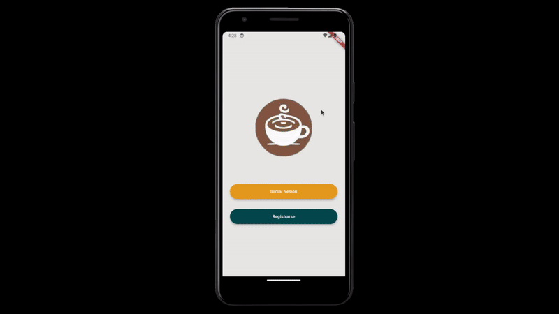
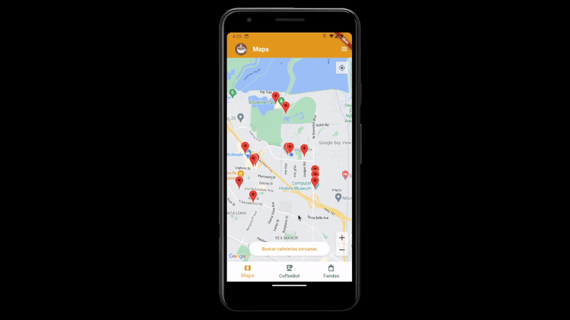
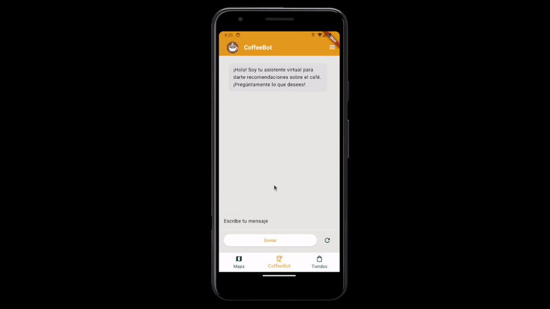

# NeighborCafe

Explore coffee next to you

## Features

* Login and register with email confirmation



* Check all the coffee shops you have around you with only one click! (And then give your opinion)



* Do you have questions about coffee? Not a problem! Talk with our CoffeeBot to solve all your problems using AI!



## Installation

### API Setup

To setup OpenAI's API, you need to go to `openai_api` folder and insert your `OPENAI_API_KEY` in the `.env`.

It is required to install `poetry`. It is a Python Dependencies Manager and makes everything easier.

Inside `openai_api` root folder, execute
```
poetry install
poetry run main
```

And the server should be up!

### Flutter setup

Please, write your `GOOGLE_MAPS_API_KEY` in the `.env` file.

To get all the dependencies, inside `neighborcafe_app`, execute
```
flutter pub get
flutter run
```

And the app is going to run in your previously selected device!
